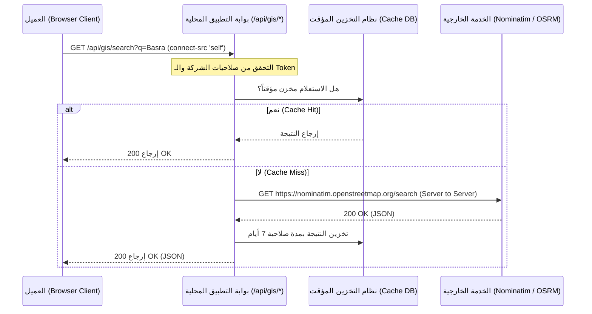
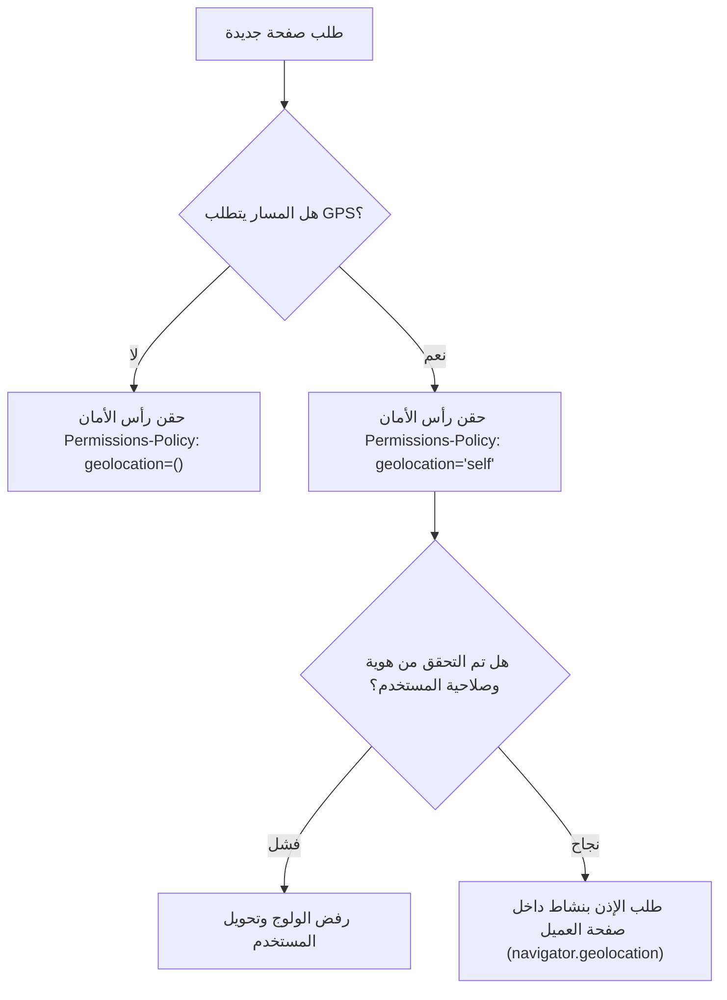
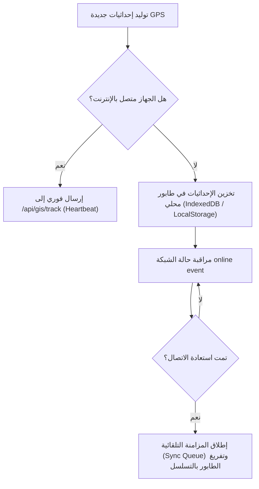

# 🗺️ وثيقة المخطط الرئيسي المعماري للخرائط والموقع الجغرافي (GIS Architecture Master Plan)

> [!IMPORTANT]
> هذه وثيقة معمارية هندسية مرجعية لتصميم وتشييد بنية الخدمات الجغرافية (GIS) وأنظمة التتبع والملاحة لمشروع ERP المحطة الخرسانية كمنصة SaaS سحابية ضخمة متعددة الشركات (Multi-Tenant). يمنع كتابة أو تعديل أي كود قبل اعتماد هذه الوثيقة.

---

## 🏛️ 1. البنية الكاملة ومخطط الطبقات (The 13-Layer Architecture)

يعتمد التصميم على مبدأ **العزل التام والمسؤولية الفردية (Decoupling & Single Responsibility)**، حيث يتم تفكيك النظام إلى 13 طبقة معزولة ومحددة المسار:

```
┌────────────────────────────────────────────────────────────────────────┐
│                        1. UI / View Layer (React)                       │
└───────────────────────────────────┬────────────────────────────────────┘
                                    ▼
┌────────────────────────────────────────────────────────────────────────┐
│                     2. Map Provider Interface Layer                    │
│           (Google Maps Adapter / OpenStreetMap / MapLibre)            │
└───────────────────────────────────┬────────────────────────────────────┘
                                    ▼
┌────────────────────────────────────────────────────────────────────────┐
│                        3. Geo Service Layer                            │
│           (GPS / Address / Geofencing / Distance / Bearing)            │
└───────────────────────────────────┬────────────────────────────────────┘
                                    ▼
┌────────────────────────────────────────────────────────────────────────┐
│                          4. Geo API Gateway                            │
│       (Browser Client HTTP Request -> /api/gis/* -> Server Proxy)      │
└───────────────────────────────────┬────────────────────────────────────┘
                                    ▼
┌────────────────────────────────────────────────────────────────────────┐
│                     5. Multi-Tenant GIS Isolation                      │
│             (Isolation at Database & Logic Layer per Tenant)           │
└───────────────────────────────────┬────────────────────────────────────┘
                                    ▼
┌────────────────────────────────────────────────────────────────────────┐
│               6. Fleet Engine & Device Management Layer                │
│       (Truck Tracking Sessions / Mixer status / Mobile Device IDs)     │
└───────────────────────────────────┬────────────────────────────────────┘
                                    ▼
┌────────────────────────────────────────────────────────────────────────┐
│                        7. Live Tracking Engine                         │
│           (Background Heartbeat / Reconnect / History / State)         │
└───────────────────────────────────┬────────────────────────────────────┘
                                    ▼
┌────────────────────────────────────────────────────────────────────────┐
│             8. Offline Storage & Queue Sync Architecture               │
│           (Local IndexedDB Queue -> Synchronize on Reconnect)         │
└───────────────────────────────────┬────────────────────────────────────┘
                                    ▼
┌────────────────────────────────────────────────────────────────────────┐
│                    9. Cache Engine (Tiles & Geocoding)                 │
│         (Node memory cache / SQLite tile Cache / HTTP Max-Age)         │
└───────────────────────────────────┬────────────────────────────────────┘
                                    ▼
┌────────────────────────────────────────────────────────────────────────┐
│                   10. ETA Engine (Route & Traffic computation)         │
│           (OSRM router / GraphHopper API / Historical Routing)         │
└───────────────────────────────────┬────────────────────────────────────┘
                                    ▼
┌────────────────────────────────────────────────────────────────────────┐
│              11. Notification & Geofencing Alert Engine                │
│         (Arrival/Leaving triggers / Order assignment matches)          │
└───────────────────────────────────┬────────────────────────────────────┘
                                    ▼
┌────────────────────────────────────────────────────────────────────────┐
│               12. Modular Security & Route Shield Layer                │
│       (Contextual CSP headers / Granular Permissions per Path)         │
└───────────────────────────────────┬────────────────────────────────────┘
                                    ▼
┌────────────────────────────────────────────────────────────────────────┐
│                         13. Database Layer (Prisma)                    │
└────────────────────────────────────────────────────────────────────────┘
```

---

## 🔄 2. تدفق البيانات والعمليات (Data & Processing Flows)

### أ. تدفق الطلبات الشبكية والأمان (Security & Network Flow)

يمنع المتصفح من إرسال أي طلب مباشر للخارج. تمر جميع الطلبات بـ Gateway محلي:



### ب. تدفق أذونات الـ GPS والصلاحيات (Permissions & Geolocation Flow)

لا يتم طلب إذن الموقع تلقائياً، بل يُدار ديناميكياً بناءً على هوية الصفحة ونوع المسار:



### ج. تدفق التتبع الحي والعمل دون إنترنت (Live Tracking & Offline Sync Flow)

يُدير محرك التتبع الحي انقطاع الإنترنت بحفظ الإحداثيات محلياً ومزامنتها تلقائياً عند استعادة الاتصال:



---

## 🏢 3. عزل تعدد الشركات والسيارات (Multi-Tenant GIS Isolation)

لمنع تداخل البيانات الجغرافية بين المستأجرين (Tenants):

1. **فصل المعرفات بالاتصال (Contextual Session Isolation):**
   كل طلب تتبع أو استعلام ملاحي يرسل من الهاتف أو المتصفح يحتوي على `Tenant-ID` مضمن وموقع رقمياً (Signed JWT).
2. **عزل قاعدة البيانات (DB Scoping):**
   تعتمد كافة جداول التتبع والأسطول الجغرافي على حقل `companyId` بشكل إجباري، وتقوم طبقة الـ Controller بالتحقق الصارم من ملكية السيارة أو السائق للشركة قبل تدوين الإحداثيات.
3. **توليد الـ Device ID:**
   يتم توليد معرف جهاز فريد وثابت لكل سيارة/سائق وتدوينه بقاعدة البيانات لربطه بجلسة تتبع نشطة (`Tracking Session`).

---

## ⏱️ 4. محرك حساب الوصول والخرائط (Map Providers & ETA Engine)

1. **واجهات المزودين المجردة (Map Provider Strategy):**
   يتم إنشاء كلاس مجرد (Abstract Class) باسم `BaseMapProvider` يحدد الدوال القياسية للرسم والتنقل. يتم إعداد محركين:
   - `OSMMapProvider`: استخدام بلاطات OpenStreetMap/CartoDB المجانية (الافتراضي).
   - `GoogleMapProvider`: استخدام Google Maps SDK (متاح للاستبدال مستقبلاً عبر ملف التكوين).
2. **محرك الـ ETA المستقل:**
   يقوم بحساب وقت الوصول التقريبي بناءً على:
   - المسافة الجغرافية المستخرجة من خوادم `OSRM`.
   - طبيعة حركة المركبات الثقيلة (سرعة شاحنات الخرسانة المحددة بـ 60 كم/ساعة بدلاً من السيارات العادية).
   - القيود الجغرافية لحركة الشاحنات داخل المدن.

---

## 🔒 5. هندسة الأمن الموزعة (Granular Security Architecture)

يتم تعديل ملف [security.ts](file:///d:/concrete-plant-system/security.ts) ليدعم **سياسات الأمان السياقية (Contextual Security Policies)** بدلاً من سياسة واحدة للمشروع بالكامل:

```typescript
export function getContextualHeaders(pathname: string): Record<string, string> {
  const headers: Record<string, string> = {
    "X-Content-Type-Options": "nosniff",
    "X-Frame-Options": "DENY",
    "X-XSS-Protection": "1; mode=block",
    "Referrer-Policy": "strict-origin-when-cross-origin",
  };

  // 1. سياسة الصفحات المستفيدة من الجيولكيشن والخرائط
  if (
    pathname.startsWith("/system/manager/tracking") ||
    pathname.startsWith("/laboratory/gis") ||
    pathname.startsWith("/track/")
  ) {
    headers["Permissions-Policy"] = "geolocation=('self')";
    headers["Content-Security-Policy"] = [
      "default-src 'self'",
      "script-src 'self' 'unsafe-inline' 'unsafe-eval'",
      "style-src 'self' 'unsafe-inline' https://fonts.googleapis.com",
      "font-src 'self' https://fonts.gstatic.com",
      "img-src 'self' data: blob: https://a.basemaps.cartocdn.com https://b.basemaps.cartocdn.com https://c.basemaps.cartocdn.com",
      "connect-src 'self'", // يُسمح فقط بالاتصال بالسيرفر المحلي (الـ Gateway)
    ].join("; ");
  } else {
    // 2. سياسة الأمان الصارمة لباقي النظام (إغلاق تام للـ GPS والاتصالات الخارجية)
    headers["Permissions-Policy"] = "camera=(), microphone=(), geolocation=()";
    headers["Content-Security-Policy"] = [
      "default-src 'self'",
      "script-src 'self'",
      "style-src 'self'",
      "connect-src 'self'",
    ].join("; ");
  }

  return headers;
}
```

---

## ⚠️ 6. تحليل المخاطر والتهديدات (Risk Assessment)

| التهديد الأمني / التقني                            | نسبة الخطورة | طريقة المعالجة والوقاية                                                           |
| :------------------------------------------------- | :----------: | :-------------------------------------------------------------------------------- |
| **هجمات الحرمان من الخدمة (Nominatim Rate limit)** |    عالية     | تفعيل كاش محلي للنتائج لمدة 7 أيام مع تفعيل محدد الطلبات الموزع (Rate Limiter).   |
| **انقطاع شبكة الهاتف المتنقل للسائقين**            |    متوسطة    | حفظ البيانات محلياً على الهواتف تلقائياً وإعادة إرسالها عند توفر الشبكة.          |
| **انتحال إحداثيات الموقع (GPS Spoofing)**          |    متوسطة    | التحقق من المعقولية الرياضية للسرعة والتوقيت وعزل جلسات التتبع بالـ Device ID.    |
| **تداخل البيانات الجغرافية للشركات**               |  حرجة جداً   | تصفية إجبارية بالـ Tenant ID في قاعدة البيانات من خلال البرمجية الوسيطة بالسيرفر. |

---

## 🚚 7. خطة الترحيل والملفات المتأثرة (Migration Strategy)

### الملفات التي سيتم إنشاؤها:

1. `lib/gis/GeoService.ts`: خدمات الـ GPS وحساب المسافات.
2. `lib/gis/MapProvider.ts`: واجهة محركات الخرائط.
3. `lib/gis/TrackingEngine.ts`: محرك التتبع الحي وحفظ الحالات أوفلاين.
4. `app/api/gis/search/route.ts`: بوابة البحث الآمنة.
5. `app/api/gis/reverse/route.ts`: بوابة العنونة المعكوسة الآمنة.
6. `app/api/gis/ip/route.ts`: بوابة تحديد الـ IP الآمنة.

### الملفات التي سيتم تعديلها:

1. `security.ts`: تعديل سياسات الأمان السياقية.
2. `proxy.ts`: تمرير وتطبيق سياسات الأمان السياقية.
3. `components/ui/MapPickerModal.tsx`: ربطها مع البوابات والـ Providers الجدد.
4. `context/PreferenceContext.tsx`: تحويل تحديد البلد التلقائي للـ Gateway المحلي.

### الملفات التي سيتم حذفها:

- `lib/map/LocationEngine.ts` (سيحل محله `GeoService` الجديد).
- `lib/map/SearchEngine.ts` (سيحل محله `GeoService` الجديد).
- `lib/network/NetworkEngine.ts` (سيندمج مع محرك الشبكة للمشروع).

---

## 🧪 8. خطة الاختبار الشاملة (Testing Strategy)

- **اختبارات الوحدة (Unit Tests):** فحص منطق حساب المسافات الجغرافية والـ Bearing وصحة الـ JSON المرتجع من الكاش.
- **اختبارات الدمج (Integration Tests):** التحقق من قدرة البوابة الداخلية `/api/gis/*` على استدعاء خوادم Nominatim وإرجاع كود 200 OK.
- **اختبارات الأمان (Security Tests):** التحقق من حظر الوصول لـ GPS بمستند المختبر عند تصفحه بمسار غير مصرح به، والتأكد من رفض المتصفح لأي اتصال خارجي مباشر.
- **اختبارات الحمل (Load Tests):** محاكاة تتبع 500 شاحنة خرسانة في نفس الوقت ترسل نبضات تتبع كل 10 ثوانٍ للتحقق من كفاءة المعالجة وعدم تجمد قاعدة البيانات.
